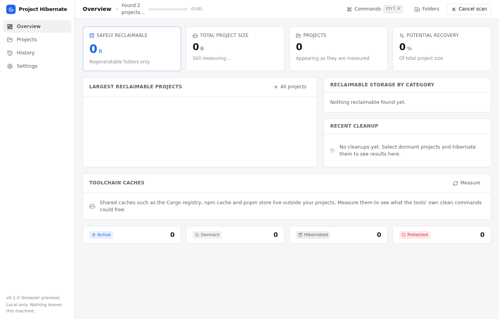
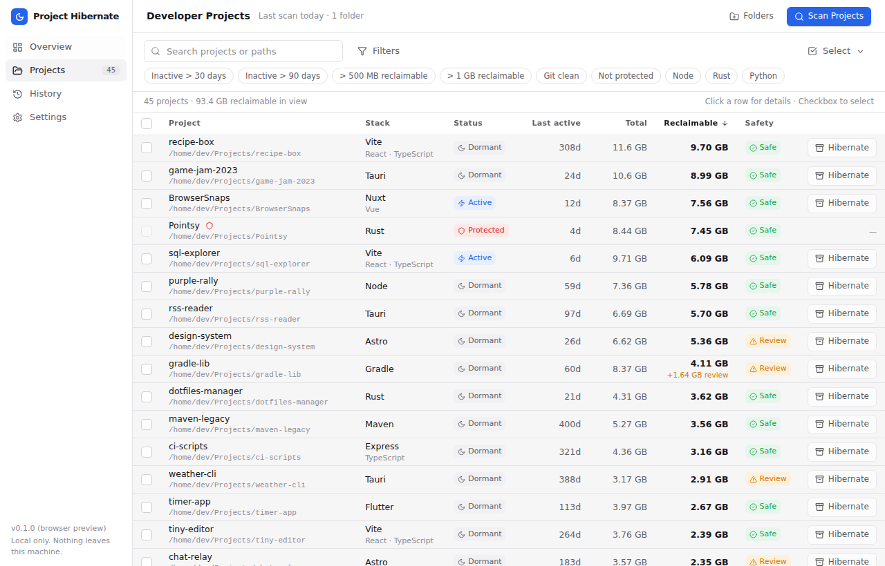
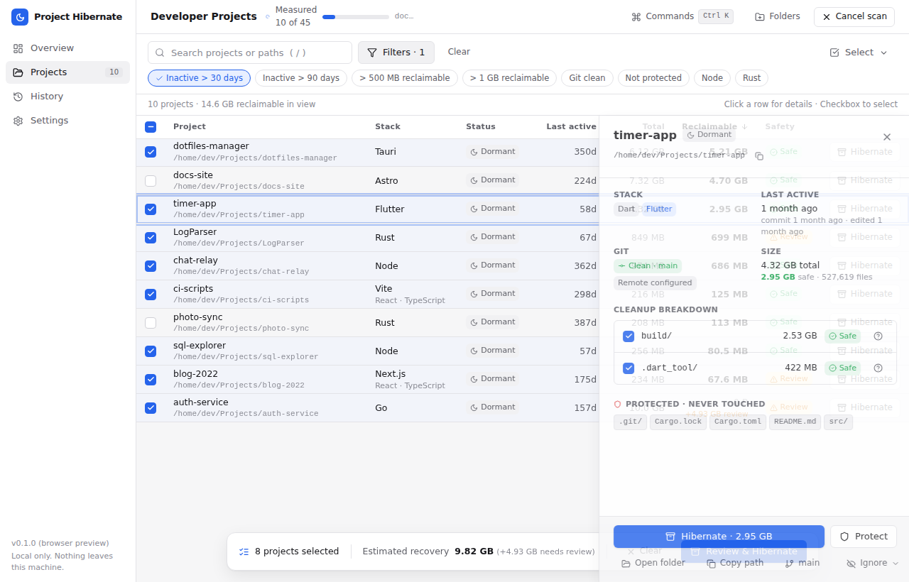
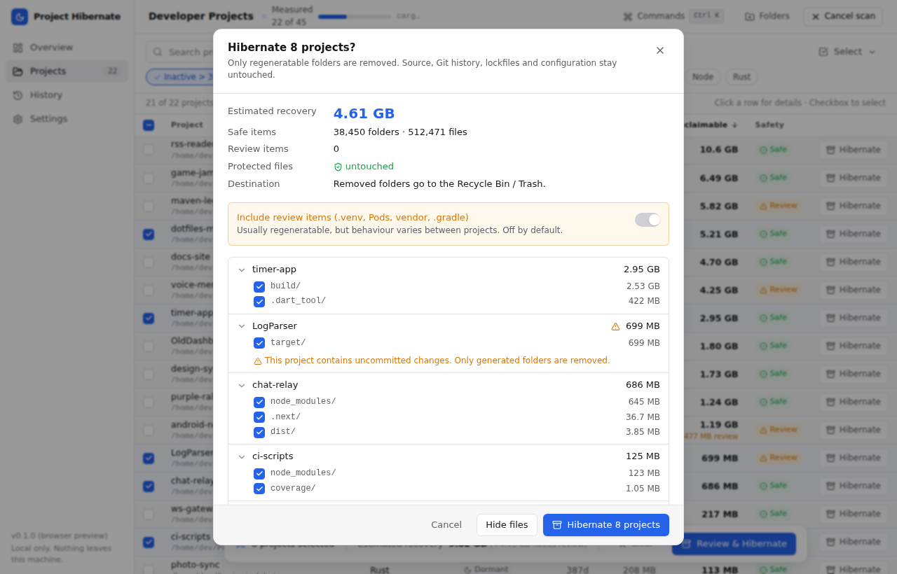
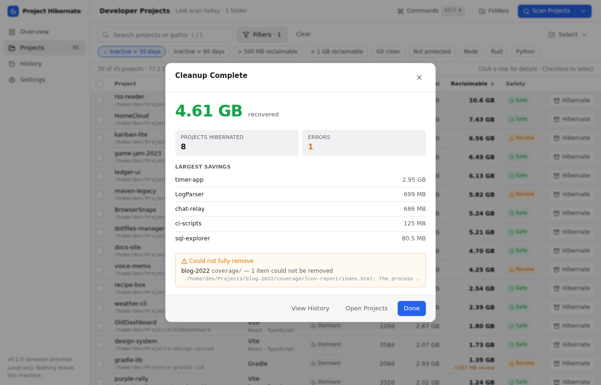
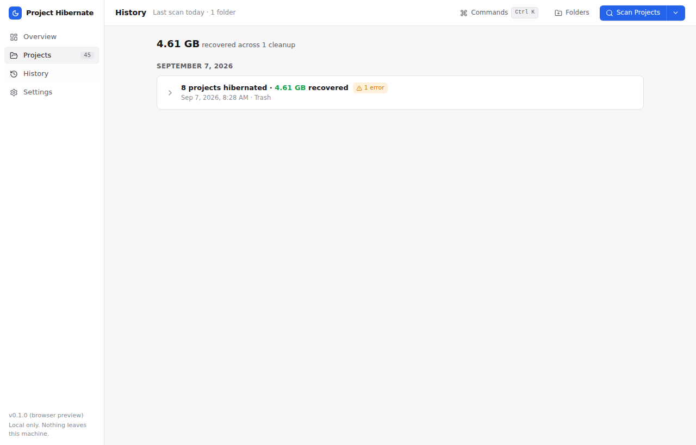
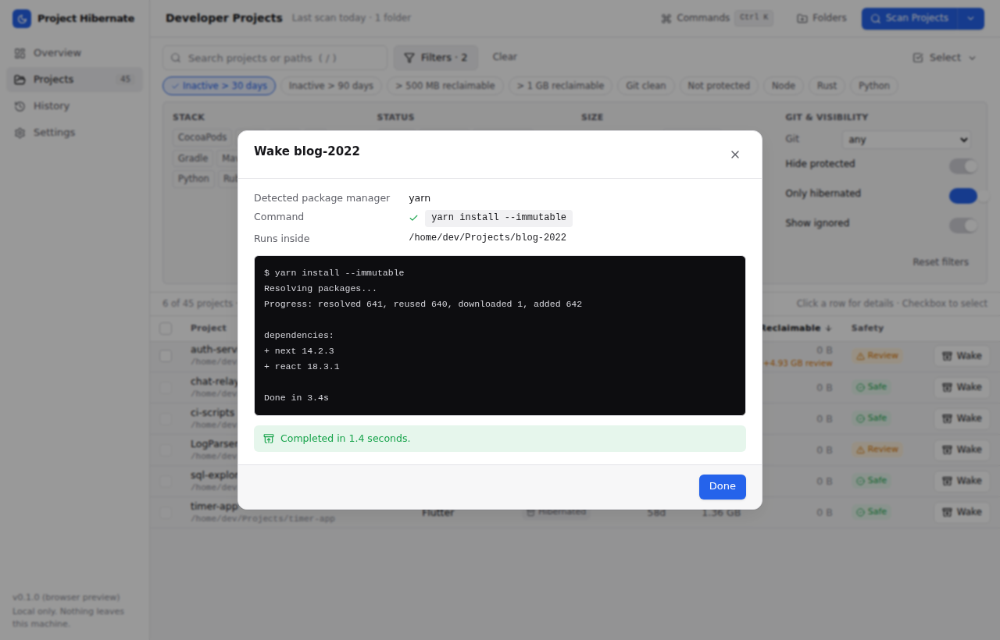
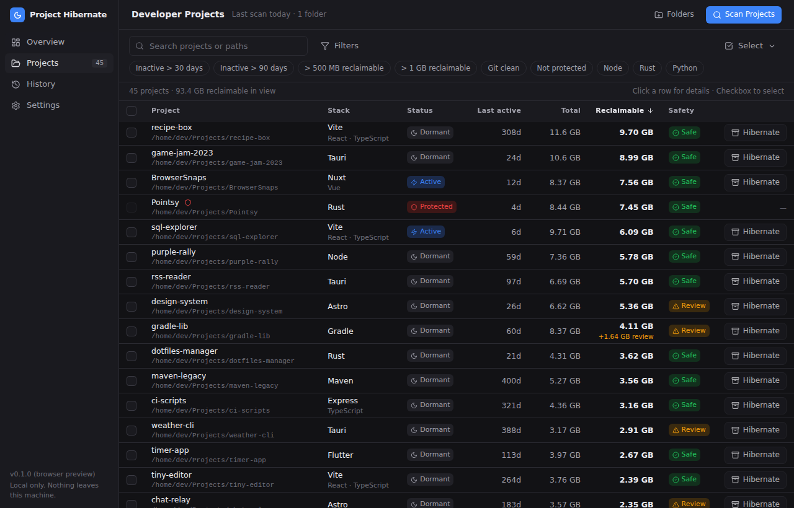

# Project Hibernate

> Keep the project. Remove what can be rebuilt.

A local-first desktop app for developers who keep dozens of side projects and
want their disk space back **without deleting source code**. It scans your
project folders, understands each project's stack, works out how much of it is
regeneratable (`node_modules/`, `target/`, `.next/`, `.venv/`, …), and lets you
**Hibernate**, **Wake**, **Protect** or **Ignore** projects from a table that
feels more like a project library than a disk cleaner.

| Project      | Stack   | Last active | Total  | Reclaimable | Status    |
| ------------ | ------- | ----------: | -----: | ----------: | --------- |
| Pointsy      | Rust    | 4 days ago  | 3.8 GB | 3.1 GB      | Active    |
| BrowserSnaps | Next.js | 14 days ago | 1.2 GB | 890 MB      | Dormant   |
| LogParser    | Rust    | 2 months ago| 8.1 GB | 7.6 GB      | Dormant   |
| Purple Rally | Next.js | Today       | 2.5 GB | 1.9 GB      | Protected |

No account, no cloud, no telemetry. Nothing leaves your machine.



<details>
<summary>More screenshots</summary>

**Projects** – search, combinable filters, bulk selection, per-project safety.



**Details drawer** – why each folder can go, what stays, how to bring it back.



**Review before anything happens** – untick individual folders, opt review items in.



**Results, history and wake**





**Dark theme**



</details>

## How it compares

There are good tools in this space. The difference is that Project Hibernate
treats the *project* as the unit of work and puts a safety gate, a review
step and a way back in front of every removal.

| | Project Hibernate | [kondo](https://github.com/tbillington/kondo) | [npkill](https://github.com/voidcosmos/npkill) | [cargo-sweep](https://github.com/holmgr/cargo-sweep) |
| --- | --- | --- | --- | --- |
| Ecosystems | Node, Rust, Python, Go, JVM, .NET, iOS, Dart, Ruby, PHP, Swift, Elixir, Haskell, Zig, Unity, Terraform | Many | Node only | Rust only |
| Desktop app + CLI | both | both | CLI | CLI |
| Safety levels per folder (safe / review / protected) | yes | no | no | no |
| Re-validates every path against the scan before deleting | yes | – | – | – |
| Never removes Git, lockfiles, `.env`, `src/`… even if a rule matches | yes | – | – | – |
| Trash / quarantine with restore | yes | no | no | no |
| Explains *why* a folder can go and how to restore it | yes | no | no | no |
| Monorepo members folded into the root (no double counting) | yes | partial | – | – |
| Wake: reinstall with the right lockfile command | yes | no | no | no |
| Last activity from source edits + Git, ignoring generated files | yes | mtime | mtime | – |
| Incremental rescans | yes | no | no | – |
| Protect / ignore projects | yes | no | no | – |

If you only want to nuke `node_modules` folders as fast as possible, `npkill`
is smaller and quicker. If you keep dozens of projects and want to be sure
nothing you wrote disappears, this is for you.

## What it does

- **Scans** one or more folders and finds project roots by their markers
  (`package.json`, `Cargo.toml`, `pyproject.toml`, `go.mod`, `pom.xml`,
  `build.gradle`, `*.sln`/`*.csproj`, `Podfile`, `pubspec.yaml`, `Gemfile`,
  `composer.json`, `Package.swift`, `mix.exs`, `*.cabal`/`stack.yaml`,
  `build.zig`, Unity `ProjectSettings/`, `*.tf`). Nested projects and
  monorepos are handled: the members a workspace declares (npm/pnpm
  `workspaces`, Cargo `members`, Gradle `include`, Maven modules, `.sln`
  projects, `go.work`) fold into their root so shared `node_modules/` is never
  double-counted, while anything else nested stays its own project.
- **Measures** total and reclaimable size per project on a bounded thread pool.
  Projects appear in the UI as soon as they are measured, before the scan is
  finished. Symlinks are never followed unless you opt in, and even then every
  directory is visited at most once.
- **Rescans incrementally.** Big trees (`node_modules/`, `target/`, `.git/`)
  are fingerprinted from two levels of modification times; when nothing
  changed, the previous size is reused instead of walking every file. "Full
  rescan" bypasses the cache, and a scheduled scan can run in the background
  with a notification when enough space is reclaimable.
- **Classifies** every candidate folder with a declarative rule:
  green *Safe* (regenerated from committed inputs), amber *Review*
  (`.venv/`, `Pods/`, `vendor/`, `.gradle/`: usually fine, never bulk-selected
  unless you opt in) or red *Protected* (`src/`, `.env`, lockfiles, `.git/`,
  `*.db`… never touched, even if a rule would match).
- **Explains** each candidate: why it can be removed, how much it recovers and
  which command brings it back.
- **Hibernates** selected projects after a review screen that shows exactly
  what goes where. Removed folders go to the OS Trash by default, or to an
  app-managed quarantine that can be restored from History, or are deleted
  permanently if you choose so. Locked files are skipped and reported, never
  silently ignored.
- **Wakes** a hibernated project by showing, then running, the right command
  for its lockfile: `npm ci`, `pnpm install --frozen-lockfile`,
  `yarn install --immutable`, `bun install --frozen-lockfile`, `cargo build`,
  `poetry install`, `uv sync`, `pip install -r requirements.txt`, …
- **Knows Git**: branch, remote, last commit time and working-tree state.
  Uncommitted changes never block a cleanup of generated folders, but they are
  shown clearly before you confirm.
- Computes **last activity** from the newest source edit and the last commit.
  Generated directories are excluded, so a stale `.next/cache` can't make an
  abandoned project look alive.
- **Shows, never touches, global caches** (Cargo registry, npm cache, pnpm
  store, pip, uv, Go modules, Gradle, Maven, Composer, CocoaPods) with each
  tool's own clean command.
- **Exports** the project table as CSV or JSON, tracks reclaimable space over
  time, and has a command palette (Ctrl/Cmd+K) with keyboard shortcuts for
  everything.

## Safety model

Every removal passes through one gate
(`crates/hibernate-core/src/cleanup/safety.rs`) that, in order, rejects:

1. empty paths and anything that is a filesystem or drive root, or too shallow
   to ever be an artifact (`/`, `C:\`, `/home`, `C:\Users`);
2. artifacts inside a *protected* project;
3. paths that were not produced by the last scan (no arbitrary paths, ever);
4. anything missing, not a directory, or a symbolic link;
5. anything whose canonical path is not strictly inside the project's
   canonical path;
6. projects outside the configured scan folders;
7. names that match a protected pattern or no cleanup rule.

Files are never removed by rules, only whole directories that a rule named.
The engine's tests cover each of these refusals, including the case where a
scan result has been tampered with to point at `src/`.

## Layout

```
crates/hibernate-core/   The engine (Rust library, no UI dependencies)
  src/scanner/           discovery → measurement → activity
  src/projects/          stack & package-manager detection
  src/cleanup/           rules, safety gate, trash, quarantine, hibernate
  src/git/               branch / remote / status without a git dependency
  src/config/ history.rs settings, persisted state, cleanup history
  src/wake.rs            wake command resolution and execution
crates/hibernate-cli/    `hibernate` CLI (scan, hibernate, wake, history, restore, protect)
src-tauri/               Tauri 2 desktop shell: commands + events over the engine
src/                     React 19 + TypeScript + Tailwind 4 + Lucide UI
```

The UI talks to the engine through a small `Backend` interface
(`src/lib/backend.ts`). In the desktop app that is Tauri; in a plain browser
(`npm run dev`) an in-memory mock fakes a progressive scan, a cleanup and a
wake so every screen can be developed without Rust.

## Install

Installers for Windows, macOS and Linux are attached to each
[GitHub release](https://github.com/lewisjohnvillamor/developer-project-cleanup/releases).
The command-line tool can be built from source today; publishing to crates.io,
Homebrew, winget and Scoop is tracked in [docs/DISTRIBUTION.md](docs/DISTRIBUTION.md).

```bash
cargo install --path crates/hibernate-cli   # puts `hibernate` on your PATH
```

## Development

Requirements: Rust (stable), Node 22, and on Linux the Tauri system libraries
(`libwebkit2gtk-4.1-dev libgtk-3-dev libayatana-appindicator3-dev librsvg2-dev`).

```bash
npm install

# Engine + CLI
cargo test                       # unit tests for the engine and CLI
cargo run -p hibernate-cli -- scan ~/Projects
cargo run -p hibernate-cli -- hibernate ~/Projects --select LogParser --dry-run
cargo run -p hibernate-cli -- wake ~/Projects/BrowserSnaps

# UI in a browser with mock data
npm run dev                      # http://localhost:1420
npm test                         # Vitest: utilities + the store against the mock backend
npm run e2e                      # Playwright walkthrough (needs the dev server running)
npm run lint                     # Biome (TypeScript lint + format check)
npm run check                    # everything above plus a production build

# Desktop app
npm run tauri dev
npm run tauri build
```

`cargo build` / `cargo test` target the engine and CLI by default; the Tauri
shell is built explicitly with `cargo build -p project-hibernate` or through
the `tauri` commands.

### CLI

```text
hibernate scan <folders…> [--json] [--no-git] [--threads N] [--min-mb N] [--full]
hibernate hibernate <folders…> --select <name|path>… | --all-dormant
                    [--dry-run] [--disposition trash|quarantine|permanent]
                    [--include-review] [-y]
hibernate wake <project> [--run] [-y]
hibernate history [--json]
hibernate restore <entry-id>
hibernate protect <project> [--off]
hibernate caches [--json]
hibernate export <folders…> [--format csv|json] [--out file]
hibernate quarantine list | purge <entry-id>
hibernate paths
```

The CLI and the desktop app share the same settings, protection list, history
and quarantine, stored under the platform data directory
(`%APPDATA%\ProjectHibernate`, `~/Library/Application Support/ProjectHibernate`,
`~/.local/share/ProjectHibernate`). Set `PROJECT_HIBERNATE_DATA_DIR` to relocate it.

## Contributing

Bug reports, rule additions for new ecosystems and platform testing are the
most useful contributions right now. See [CONTRIBUTING.md](CONTRIBUTING.md),
the [roadmap](ROADMAP.md) for what is in and out of scope, and
[SECURITY.md](SECURITY.md) for reporting anything that could delete the wrong file.

## Releasing

`npm run version:bump 0.2.0` updates every version field, then tag and push
(`git tag v0.2.0 && git push origin v0.2.0`). The release workflow builds
Windows, macOS and Linux installers into a draft GitHub release. Signing and
notarization are optional and driven by repository secrets; see
[docs/RELEASING.md](docs/RELEASING.md).

## Status

This is the v0.1 MVP from the [specification](developer-project-cleanup-spec.md)
plus most of the v0.2/v0.3 roadmap (see [CHANGELOG.md](CHANGELOG.md)):
scanning, stack detection, reclaimable sizes, search and filters, bulk
selection, protection, per-artifact explanations, review-then-hibernate with
progress and results, history with quarantine restore, wake, and a
light/dark/system theme. Node, Rust and Python are first-class; Go, Maven,
Gradle, .NET, CocoaPods, Dart/Flutter, Ruby and PHP are detected with their
main artifacts.

Not in scope, on purpose: accounts, cloud sync, Docker or OS-wide cleaning,
duplicate finders, IDE plugins.
